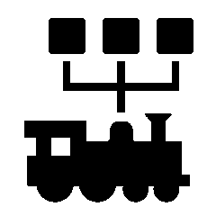

# The Project

The LOCO-CAN project is an electronic control system for the large passenger-carrying garden railway. The communication is based on the CAN bus, which is used in the automotive industry and in automation. The serial signal transmission is very robust and supports multiple masters and multiple slaves.

The modular system consists of different components with specialized tasks. For example, there are modules for operating, for controlling motor controls, light switch modules or sensors for current and voltage measurement or speed values. Actuators that are addressed by a servo module can even be used to control diesel engines or gearboxes.

Due to the flexibility of the CAN bus, additional modules can easily be connected without having to change the existing structure.

The system is not only intended for networking within a traction vehicle, but can also be routed through the train via a four-pole cable. This means that not only can control consoles be connected at any point in the train, but also, for example, lights in wagons can be operated.

The system is still under developement. The CAN-specification is defined but can be extended. Board designs are available in different versions, due to the process of evolvement. Besides bugs in the board design details like the pinout of the program interface differ between the versions.

[Hardware repository](https://github.com/loco-can/loco-can-hardware)

[Software repository](https://github.com/loco-can/loco-can-software)
